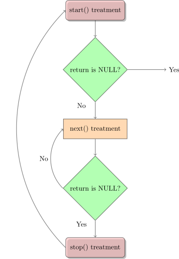

## 模块基本信息相关

### 导出符号

Linux的`/proc/kallsyms`文件是内核符号表，它记录了符号以及符号所在的内存地址。

模块使用如下宏导出符号到内核符号表中：

```C
EXPORT_SYMBOL(symbol_name);
EXPORT_SYMBOL_GPL(symbol_name); // 只适用于包含GPL许可权的模块
```

只有导出的符号才可以被其他模块使用，但需使用前声明。

## 模块的编译

使用`EXTRA_CFLAGS`加上额外的编译参数：

```bash
EXTRA_CFLAGS=-g -O0
```

## 驱动与文件系统

在设备驱动程序的设计中，一般会比较关心file和inode这两个结构体。

### file结构体

file结构体代表一个打开的文件，系统中每个打开的文件在内核空间都有一个关联的struct file。它由内核在打开文件时创建，并传递给在文件上进行操作的任何函数。在文件的所有实例都关闭后，内核释放这个数据结构。

```C
struct file {
    union {
        struct list_node 	fu_llist;
        struct rct_head		fu_rcuhead;
    } f_u;
	struct path		f_path;
#define f_dentry	f_path.dentry
    struct inode 	*f_inode;	/* cached value */
    const struct file_operations *f_op;	/* 和文件关联的操作 */
    
    /*
     * Protects f_ep_links, f_flags.
     * Must not be taken from IRQ context.
     */
    spinlock_t 		f_lock;
    atomic_long_t	f_count;
    unsigned int	f_flags;	/* 文件标志，如O_RDONLY, O_NONBLOCK, O_SYNC */
    fmode_t			f_mode;		/* 文件读/写模式，FMODE_READ和FMODE_WRITE */
    struct mutex	f_pos_lock;
    loff_t			f_pos;		/* 当前读写位置 */
    struct fown_struct	f_owner;
    const struct cred	*f_cred;
    struct file_ra_statef_ra;
    
    u64				f_version;
    void 			*private_data;	/* 文件私有数据 */
    
    struct address_space *f_mapping;
} __attribute__((aligned(4)));	
```

### inode结构体

VFS inode包含文件访问权限、属主、组、大小、生成时间、访问时间、最后修改时间等信息。它时Linux管理文件系统的最基本单位，也是文件系统连接任何子目录、文件的桥梁。

```C
struct inode {
    ...
    umode_t i_mode;			/* inode的权限 */
    uid_t	i_uid;			/* inode拥有者的id */
    gid_t	i_gid;			/* inode所属的群组id */
    dev_t	i_rdev;			/* 若是设备文件，此字段将记录设备的设备号 */
    loff_t	i_size;			/* inode所代表的文件大小 */
    
    struct timespec	i_atime;	/* inode最近一次的存取时间 */
    struct timespec i_mtime;	/* inode最近一次的修改时间 */
    struct timespec i_ctime;	/* inode的产生时间 */
    
    unsigned int 	i_blkbits;
    blkcnt_t	i_blocks;		/* inode所使用的block数，一个block为512字节 */
    union {
        struct pipe_inode_info	*i_pipe;
        struct block_device	*i_bdev;	/* 若是块设备，为其对应的block_device结构体指针 */
        struct cdev	*i_cdev;	/* 若为字符设备，为其对应的cdev结构体指针 */
    }
}
```

## 字符设备驱动

`file_operations` 结构体定义在`include/linux/fs.h`，每一个字符设备驱动都需要定义这个结构体。

从Linux v5.6开始，`proc_ops`结构体替代了`file_operations`结构体当注册proc handlers的时候。

### 注册一个Device

**老的注册设备接口**

字符设备的访问通过设备文件，通常在`/dev`目录下。

* `major number`告诉你哪个driver处理哪个设备文件；
* `minor number`被driver自身用来分辨操作的是哪一个设备。

使用`register_chrdev`函数注册一个字符设备到内核，在`include/linux/fs.h`中定义。

```C
/**
 * @major: the major number you want to request, if 0, the return value will be the dynamically allocated major number
 * @name: is the name of the device as it will appear in /proc/devices
 * @fops: is a pointer to the file_operations table for your driver
 */
int register_chrdev(unsigned int major, const char *name, struct file_operations *fops);
```

可惜的是，不能在注册设备的同时创建设备文件，因为我们不知道设备的`major number`是多少。有下面几种方法可以去创建设备文件：

1. driver输出新分配的主设备号，然后手动创建该文件(使用mknod命令)；
2. 新创建的设备会在`/proc/devices`中出现，可以通过脚本找出设备号，然后创建设备文件；
3. 通过driver去创建设备文件，在注册成功后通过`device_create`函数创建，在`cleanup_module`中通过`device_destroy`注销。

然而，`register_chrdev`将会占有一整个范围的与主设备号相连的`minor numbers`。通过使用最新的设备注册接口`cdev`可以减少浪费。

**新的注册设备接口**

新的接口需要两个步骤去完成设备的注册。

1. 我们需要注册一个范围的设备号，使用如下两个函数：

```C
// If you know the device major number
int register_chrdev_region(dev_t from, unsigned count, const char *name); 
// If you would like to allocate a dynamicly-allocated major number
int alloc_chrdev_region(dev_t *dev, unsigned baseminor, unsigned count, const char *name);
```

使用哪个函数完全决定于你是不是知道主设备号。

2. 我们需要初始化`struct cdev`并且将其关联到设备号。

我们可以通过以下代码来完成初始化：

```C
struct cdev *my_dev = cdev_alloc(); 
my_cdev->ops = &my_fops;
```

然而，通常情况下会将`struct cdev`嵌入到我们自己的设备相关的结构体中，所以我们需要`cdev_init`用于初始化。

```C
void cdev_init(struct cdev *cdev, const struct file_operations *fops);
```

一旦我们初始化完成，就可以将该设备通过`cdev_add`函数加入到系统了。

```C
int cdev_add(struct cdev *p, dev_t dev, unsigned count);
```

### 注销一个设备

有一个计数器来跟踪有多少个进程正在使用内核模块。可以通过查看`cat /proc/modules`和`sudo lsmod`的结果的第三列来知道当前的计数器值是多少。如果计数器不是0，`rmmod`会失败。这是被`sys_delete_module`函数检查的，定义在`include/linux/syscall.h`中。我们不应该在模块中直接使用该计数器，但是可以通过一些函数操作它：

- `try_module_get(THIS_MODULE) `: Increment the reference count of current module.
- `module_put(THIS_MODULE) `: Decrement the reference count of current module.
- `module_refcount(THIS_MODULE) `: Return the value of reference count of current module.

比如保持计数器的正确，不然就永远不能卸载掉当前的模块了。

## /proc 文件系统

/proc文件系统是内核提供的额外的机制用于内核和内核模块给进程发送信息，原先被设计为访问进程的相关信息，这也是它的名字的由来。

使用`proc_create`系统调用创建`/proc`文件，该函数的返回值为`struct proc_dir_entry`，这会被用来配置文件`/proc/<proc_name>`，NULL的返回值意味着创建失败。

```C
struct proc_dir_entry *proc_create(const char *name, umode_t mode,
                                   ¦  struct proc_dir_entry *parent,
                                   ¦  const struct proc_ops *proc_ops);
```

对于`proc_read`来说，有两个参数是需要特别注意的，`buffer`和`offset`参数。`buffer`中的内容会被返回给用户程序读取；`offset`是当前读取文件的位置。如果返回值不为0，该函数将会被重复的调用，所以请小心。

```C
ssize_t proc_read(struct file *filp, char __user *buffer,
                            ¦    size_t buffer_length, loff_t *offset)
```

### proc_ops Structure

自从Linux v5.6+开始，`proc_ops`结构体定义在了`include/linux/proc_fs.h`，一个是因为`file_operations`中的很多项对于procfs来说没有用，另一个是在`proc_ops`中定义了`proc_flag`变量，可以用来设置成`PROC_ENTRY_PERMANENT`标志，表示该文件从来不会消失，这会在一次`open/read/close`流程中节省2个原子操作，1次分配，1次释放操作。

### 使用seq_file管理proc文件

`/proc`将内容手动写入user的buffer里面是非常复杂的，所以开发出了`seq_file`这个API来帮助格式化`proc`文件的输出。seq_file基于sequence，由3个函数组成：start(), next(), and stop(). 

一个sequence的开始于对`start()`函数的调用。如果返回值不是NULL，`next()`将被调用。这个函数是一个迭代器，它的目标是遍历所有的数据。每当`next()`被调用的时候，函数`show()`同时被调用。它将数据值写入被user读取的buffer，函数`next()`一直被调用直到它返回NULL。当`next()`返回NULL的时候，函数`stop()`将被调用。



注意：当一个sequence结束之后，新一轮的sequence又会开始。当`start()`返回NULL的时候，循环结束。

**一般来说，proc文件系统只会用于向用户层输出信息，不会接收用户层的输入，也就是没有proc_write函数。**

这里提供一个非常简单的procfs的模板，只有输出信息的功能，不过一般情况下都够用了。

```C
#include <linux/module.h>
#include <linux/kernel.h>
#include <linux/proc_fs.h>
#include <linux/seq_file.h>

static int my_proc_show(struct seq_file *m, void *v)
{
        seq_write(m, "proc hello world!\n", 18);
        return 0;
}

int proc_init(void)
{
        proc_create_single("my_proc", 0, NULL, my_proc_show);
        return 0;
}

void proc_exit(void)
{
        remove_proc_entry("my_proc", NULL);
}

module_init(proc_init);
module_exit(proc_exit);

MODULE_LICENSE("GPL");
```

在`/include/linux/seq_file.h`文件中有很多的seq输出的函数，需要的时候查阅这个头文件即可。

## sysfs: Interacting with your module

sysfs允许用户程序与内核交互，并且可以读取或设置模块中的变量。可以在`/sys`目录下找到所有的`sysfs`文件。

sysfs使用一个文件对应内核当中的一个变量，并且提供了`show`和`store`两个接口分别读取和设置该变量。

具体示例可以参考`samples/kobject/kobject-example.c`。

## debugfs

Unlike /proc, which is only meant for information about a process, or sysfs, which has strict one-value-per-file rules, debugfs has no rules at all.

debugfs可以随意的将一个文件对应到任意一个操作上，使用起来很自由。

## 使用ioctl与设备文件进行通信

除了之前的对设备读写的操作之外，`ioctl`提供了对硬件的控制能力。

在用户空间中，使用ioctl系统调用来控制设备：

```C
// 用户空间的ioctl
int ioctl(int fd,unsigned long cmd,...);
/*
fd:文件描述符
cmd:控制命令
...:可选参数:插入*argp，具体内容依赖于cmd
*/
```

而在内核空间里的ioctl则以接口的方式存在，其定义如下：

```C
int (*ioctl) (struct inode *inode,struct file *filp,unsigned int cmd,unsigned long arg);
/*
inode与filp两个指针对应于应用程序传递的文件描述符fd，这和传递open方法的参数一样。
cmd 由用户空间直接不经修改的传递给驱动程序
arg 可选。
*/
```

可以看到，在`ioctl`中两者相同的部分就是`cmd`命令码，在Linux中将一个命令码定义成如下形式（这个不一定对，看个大概就好）：

```C
| 设备类型  | 序列号 |  方向 | 数据尺寸 |

|----------|--------|------|-------- |

| 8 bit　　 |  8 bit   | 2 bit |8~14 bit|

|----------|--------|------|-------- |
```

同时Linux也提供了一些宏，将上面这些离散的变量变成一个命令码，或者从命令码中读取出对应的设备类型、序列号、数据传送方向和数据传输尺寸。

```C
// nr为序号，datatype为数据类型,如int
// 读或写都是站在userspace的角度上看的
_IO(type, nr ) //没有参数的命令
_IOR(type, nr, datatype) //从驱动中读数据
_IOW(type, nr, datatype) //写数据到驱动
_IOWR(type,nr, datatype) //双向传送
```


